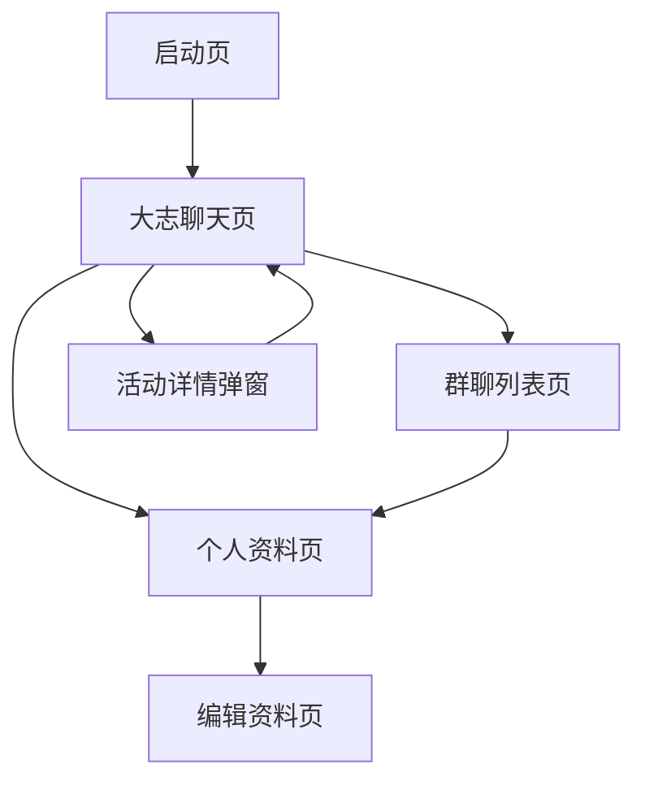

## 1. 产品概述

这是一个基于现有dz_apk项目的独立H5 Demo模型，用于产品流程设计和展示。Demo包含三个核心功能模块：AI聊天助手、群聊列表和个人资料管理。所有数据均为模拟数据，无需外部服务依赖。

该Demo旨在帮助产品团队快速验证交互流程和界面设计，为后续开发提供可视化参考。

## 2. 核心功能

### 2.1 用户角色
| 角色 | 注册方式 | 核心权限 |
|------|----------|----------|
| 普通用户 | 无需注册，默认体验 | 使用AI聊天、查看群聊、管理个人资料 |

### 2.2 功能模块

Demo包含以下核心页面：
1. **大志聊天页**：AI足球助手对话界面，支持活动推荐和报名
2. **群聊列表页**：展示足球活动群聊列表，显示未读消息和活动信息
3. **个人资料页**：用户个人信息展示和编辑功能

### 2.3 页面详情

| 页面名称 | 模块名称 | 功能描述 |
|-----------|-------------|-------------|
| 大志聊天页 | 对话界面 | 显示用户与AI的对话消息，支持文本输入和发送 |
| 大志聊天页 | 欢迎界面 | 展示大志Logo、标题、副标题和快捷提问按钮 |
| 大志聊天页 | 活动卡片 | 在AI回复中展示可报名的足球活动信息 |
| 大志聊天页 | 输入区域 | 消息输入框、发送按钮和快捷操作按钮 |
| 群聊列表页 | 群聊列表 | 展示足球活动群聊，包含活动名称、最后消息、未读数 |
| 群聊列表页 | 群聊项 | 显示群头像、名称、未读徽章、成员数和通知状态 |
| 个人资料页 | 用户信息 | 展示用户头像、昵称、ID和编辑按钮 |
| 个人资料页 | 设置选项 | 提供账户安全、帮助反馈、关于我们等入口 |
| 编辑资料页 | 资料编辑 | 支持修改昵称、头像等个人信息 |
| 全局组件 | 底部导航 | 三个Tab切换：大志、群聊、我的 |

## 3. 核心流程

### 3.1 AI聊天流程
1. 用户进入大志聊天页，看到欢迎界面和快捷提问
2. 用户点击快捷问题或手动输入问题发送消息
3. 用户消息显示在对话区域右侧
4. AI回复消息显示在左侧，可能包含活动推荐卡片
5. 用户可点击活动卡片查看详情并报名
6. 支持开始新话题重置对话状态

### 3.2 群聊浏览流程
1. 用户切换到群聊Tab，查看活动群聊列表
2. 每个群聊项显示活动名称、最后消息、未读数和成员数
3. 点击群聊项可进入群聊详情（Demo中为展示状态）

### 3.3 个人资料管理流程
1. 用户进入个人资料页查看基本信息
2. 点击编辑按钮进入编辑模式
3. 修改昵称、头像等信息
4. 保存修改返回资料页

## 4. 用户界面设计

### 4.1 设计风格
- **主色调**：橙色(#E65100)作为主品牌色，用于按钮、强调元素
- **辅助色**：白色背景，灰色文字，蓝色链接色
- **按钮样式**：圆角矩形，实心填充，文字白色
- **字体层级**：标题18px，正文16px，小字14px
- **布局风格**：卡片式布局，阴影效果，圆角边框
- **图标风格**：使用emoji表情符号，简洁直观

### 4.2 页面设计概述

| 页面名称 | 模块名称 | UI元素 |
|-----------|-------------|-------------|
| 大志聊天页 | 对话界面 | 左右消息气泡区分，用户消息橙色右对齐，AI消息白色左对齐 |
| 大志聊天页 | 欢迎界面 | 居中布局，大志标题橙色大字体，副标题灰色小字，快捷按钮卡片样式 |
| 大志聊天页 | 活动卡片 | 白色卡片带阴影，包含活动名称、时间地点、报名人数和橙色报名按钮 |
| 群聊列表页 | 群聊列表 | 垂直列表，每个群聊项为白色卡片，包含圆形头像和详细信息 |
| 个人资料页 | 用户信息 | 圆形头像，昵称大字体，ID小字，橙色编辑按钮 |
| 底部导航 | Tab栏 | 白色背景，图标+文字，选中状态橙色高亮 |

### 4.3 响应式设计
- **移动优先**：基于375px宽度设计，适配各种手机屏幕
- **弹性布局**：使用flex布局，自动适应不同屏幕尺寸
- **触摸优化**：按钮最小44px点击区域，适合触摸操作
- **字体适配**：使用相对单位，支持系统字体大小设置

### 4.4 交互细节
- **加载状态**：发送消息时显示加载指示器
- **按钮状态**：禁用状态灰色显示，可点击状态橙色
- **滚动行为**：键盘弹出时自动滚动到最新消息
- **动画效果**：页面切换平滑过渡，按钮点击有反馈效果