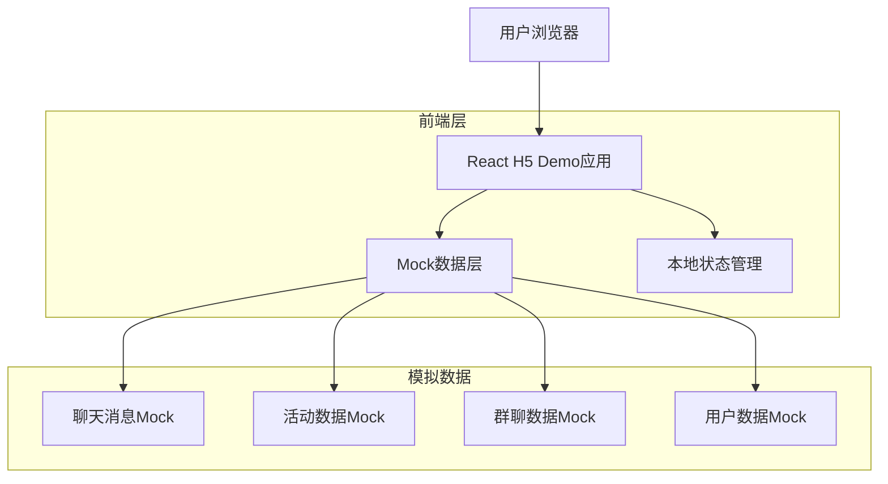
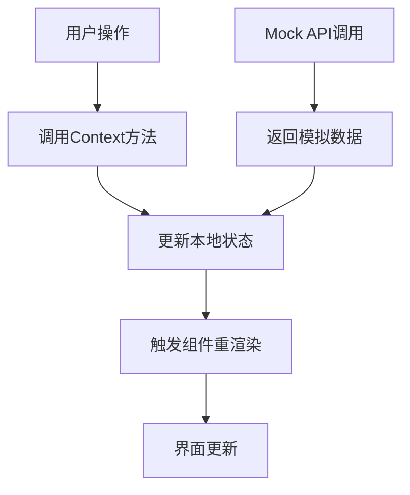

## 1. 架构设计



## 2. 技术描述

- **前端**: React@18 + TypeScript + Vite
- **样式方案**: Tailwind CSS + CSS Modules
- **状态管理**: React Context + useState/useReducer
- **初始化工具**: Vite-init
- **移动端**: 移动优先响应式设计
- **构建工具**: Vite (开发服务器 + 构建)
- **依赖管理**: npm/yarn

### 核心依赖
```json
{
  "dependencies": {
    "react": "^18.2.0",
    "react-dom": "^18.2.0",
    "react-router-dom": "^6.8.0"
  },
  "devDependencies": {
    "@types/react": "^18.0.0",
    "@types/react-dom": "^18.0.0",
    "@vitejs/plugin-react": "^3.1.0",
    "tailwindcss": "^3.2.0",
    "typescript": "^4.9.0",
    "vite": "^4.1.0"
  }
}
```

## 3. 路由定义

| 路由 | 用途 |
|-------|---------|
| / | 大志聊天页，默认首页 |
| /groups | 群聊列表页 |
| /profile | 个人资料页 |
| /profile/edit | 编辑个人资料页 |

## 4. 组件架构

### 4.1 页面组件
```
src/
├── pages/
│   ├── ChatPage.tsx          // 大志聊天页
│   ├── GroupsPage.tsx        // 群聊列表页
│   ├── ProfilePage.tsx       // 个人资料页
│   └── EditProfilePage.tsx   // 编辑资料页
```

### 4.2 核心组件
```
src/
├── components/
│   ├── ActivityCard.tsx      // 活动卡片组件
│   ├── ActivityCardList.tsx  // 活动列表组件
│   ├── MessageBubble.tsx     // 消息气泡组件
│   ├── ChatInput.tsx         // 聊天输入组件
│   ├── BottomNav.tsx         // 底部导航组件
│   └── Header.tsx            // 页面头部组件
```

### 4.3 上下文管理
```
src/
├── contexts/
│   ├── ChatContext.tsx       // 聊天状态管理
│   ├── UserContext.tsx       // 用户状态管理
│   └── AppContext.tsx        // 全局应用状态
```

## 5. 数据模型

### 5.1 聊天消息模型
```typescript
interface Message {
  id: string;
  text: string;
  isUser: boolean;
  isLoading?: boolean;
  activityIds?: number[];
  timestamp?: number;
}

interface ChatState {
  messages: Message[];
  isSending: boolean;
  conversationId?: string;
}
```

### 5.2 活动数据模型
```typescript
interface ActivityInfo {
  activityId: number;
  activityName: string;
  startTime: string;
  location: string;
  signupNum: number;
  limitNum: number;
  remark?: string;
}

interface ActivityDetail {
  activityInfo: ActivityInfo;
  description: string;
  requirements: string[];
  contactInfo: string;
}
```

### 5.3 群聊数据模型
```typescript
interface ChatGroup {
  id: string;
  name: string;
  lastMessage?: string;
  unreadCount: number;
  memberCount: number;
  hasNotification: boolean;
  lastMessageTime?: string;
}

interface GroupState {
  groups: ChatGroup[];
  isLoading: boolean;
}
```

### 5.4 用户数据模型
```typescript
interface User {
  id: string;
  nickname: string;
  avatar: string;
  phone?: string;
  email?: string;
  createdAt: string;
}

interface UserState {
  user: User;
  isEditing: boolean;
}
```

## 6. Mock数据策略

### 6.1 聊天消息Mock
```typescript
// 初始欢迎消息
const welcomeMessages = [
  {
    id: 'welcome_1',
    text: '我是大志，你的足球活动助手！',
    isUser: false,
    timestamp: Date.now()
  }
];

// AI回复模板
const aiResponseTemplates = [
  '我为您找到了几个合适的足球活动：',
  '根据您的需求，推荐以下活动：',
  '这些活动可能适合您：'
];
```

### 6.2 活动数据Mock
```typescript
const mockActivities: ActivityInfo[] = [
  {
    activityId: 1,
    activityName: '本周六 18:00 太阳宫足球俱乐部',
    startTime: '2024-01-20 18:00',
    location: '太阳宫足球俱乐部',
    signupNum: 8,
    limitNum: 12,
    remark: '五人制，水平中上'
  },
  // ... 更多活动数据
];
```

### 6.3 群聊数据Mock
```typescript
const mockGroups: ChatGroup[] = [
  {
    id: '1',
    name: '本周六 18:00 太阳宫足球俱乐部',
    lastMessage: '明天有人来吗？',
    unreadCount: 2,
    memberCount: 8,
    hasNotification: true,
    lastMessageTime: '10:30'
  },
  // ... 更多群聊数据
];
```

## 7. 状态管理架构

### 7.1 全局状态结构
```typescript
interface AppState {
  chat: ChatState;
  user: UserState;
  groups: GroupState;
  ui: UIState;
}

interface UIState {
  activeTab: 'chat' | 'groups' | 'profile';
  isLoading: boolean;
  showTabBar: boolean;
}
```

### 7.2 状态管理流程


## 8. 组件通信架构

### 8.1 父子组件通信
- Props向下传递数据和回调函数
- 子组件通过回调函数向父组件传递事件

### 8.2 兄弟组件通信
- 通过共同的父组件状态管理
- 使用Context进行跨组件状态共享

### 8.3 页面间通信
- 使用React Context进行全局状态管理
- 通过路由参数传递必要数据

## 9. 性能优化策略

### 9.1 渲染优化
- 使用React.memo优化纯组件
- 合理使用useMemo和useCallback
- 虚拟滚动处理长列表

### 9.2 状态优化
- 避免不必要的全局状态
- 合理拆分Context，减少重渲染范围
- 使用useReducer管理复杂状态

### 9.3 资源优化
- 图片懒加载
- CSS代码分割
- 组件按需加载

## 10. 开发规范

### 10.1 代码规范
- TypeScript严格模式
- ESLint代码检查
- Prettier代码格式化

### 10.2 文件命名
- 组件文件：PascalCase (如：ChatPage.tsx)
- 工具文件：camelCase (如：mockData.ts)
- 样式文件：与组件同名 (如：ChatPage.module.css)

### 10.3 目录结构
```
h5_demo/
├── public/               # 静态资源
├── src/
│   ├── pages/           # 页面组件
│   ├── components/      # 通用组件
│   ├── contexts/        # 状态管理
│   ├── hooks/           # 自定义Hook
│   ├── utils/           # 工具函数
│   ├── mocks/           # 模拟数据
│   ├── types/           # TypeScript类型
│   └── styles/          # 全局样式
├── documents/           # 项目文档
└── package.json
```